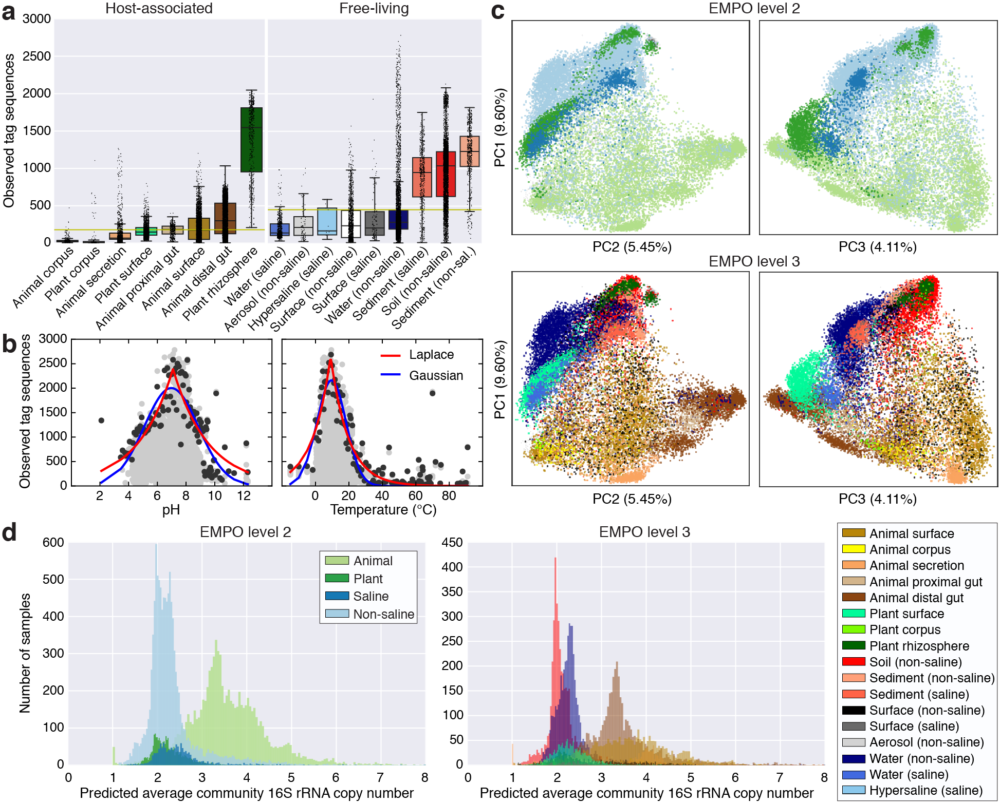
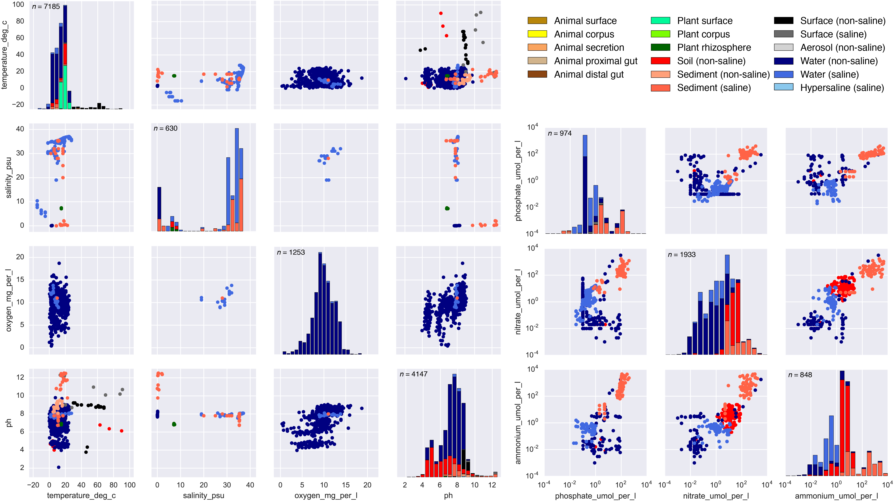
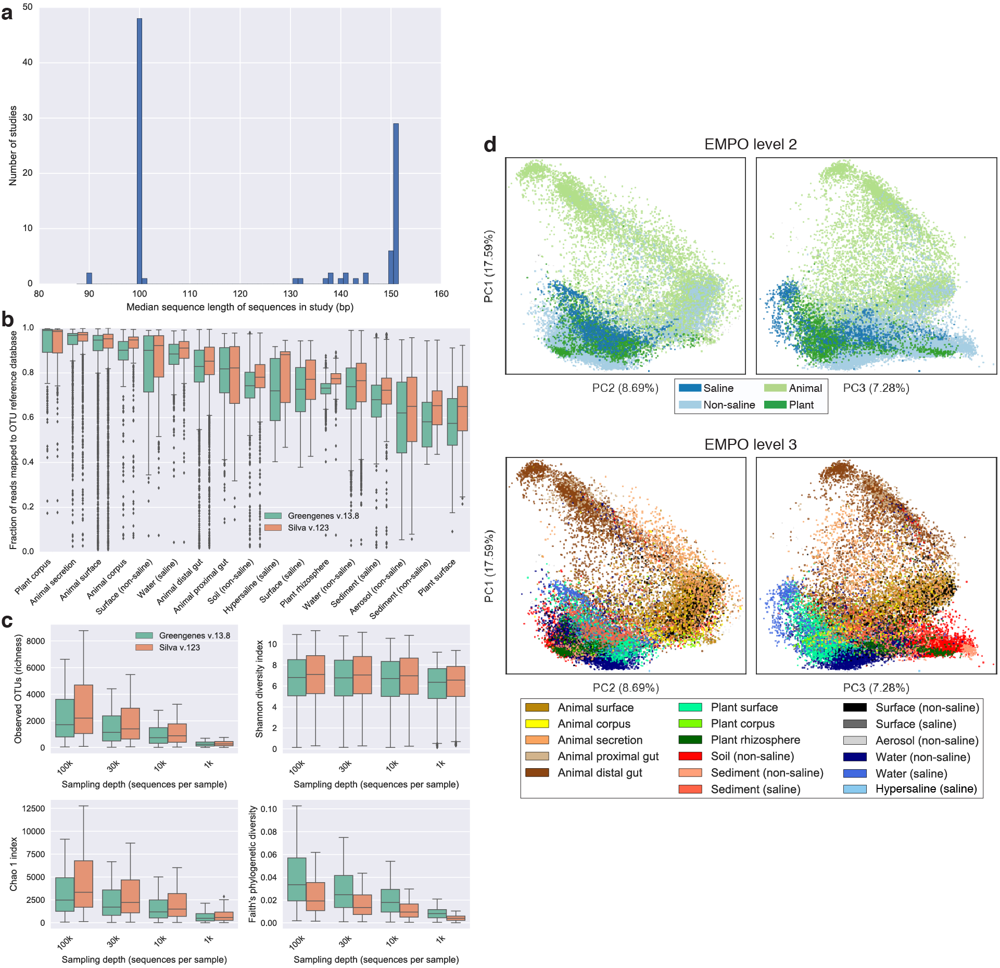

## figures

Instructions to generate the figures in "A communal catalogue reveals Earth’s multiscale microbial diversity", Thompson et al., *Nature* (2017). This manuscript describes the meta-analysis of EMP 16S Release 1, the first 97 studies subjected to 16S rRNA amplicon sequencing through the [Earth Microbiome Project](http://www.earthmicrobiome.org).

Source data (ready-to-plot) for the main figures (and notebooks for isolating the source data from other processed files) are in `figures/figure-data`.

Raw and processed data files for generating the figures are found in several places:

* All data files (except sequences) required to generate the figures are in `data` and/or available from ftp://ftp.microbio.me/emp/release1. FTP directory contents are listed in `data/ftp_contents.txt`.
* For archival purposes, sample metadata, observation tables and information (trees and taxonomies), alpha- and beta-diversity results, and observation summaries for trading cards are archived at Zenodo with DOI [XXX](http://doi.org/XXX).
* Sequence files are available directly from EBI (see below).
* The mapping file (metadata) for analyses, unless otherwise noted, is `emp_qiime_mapping_qc_filtered.tsv` in `data/mapping_files`.

Code and notebooks for data processing and figure generation are in the top-level directory `code`, as described below.

### 1 Amplicon sequence processing

This section describes the commands to download the raw sequence data from EBI and perform OTU picking using different methods, including generating phylogenetic trees and taxonomies for reference sequences, if necessary.

#### 1.1 Download demultiplexed fasta sequence files

Per-study sequence files can be downloaded directly from EBI using scripts in `code/download-sequences`:

* `download_ebi_fasta.sh` (FASTA) 
* `download_ebi_fastq.sh` (FASTQ) 

Fasta sequences are used by the steps below. The sequences from EBI were demultiplexed and minimally quality filtered using the QIIME 1 command [split_libraries_fastq.py](http://qiime.org/scripts/split_libraries_fastq.html) with Phred quality threshold of 3 and default parameters.

Any adapter contamination was removed using the code in `code/02-sequence-processing`:

* `adaptor_cleanup.ipynb`

#### 1.2 Generate sequence/OTU observation tables

Four separate OTU picking procedures were run on the EMP Release 1 data: de novo using Deblur, closed-reference using Greengenes 13.8, closed-reference using Silva 123, and open-reference using Greengenes 13.8.

##### 1.2.1 Deblur (de novo sequence variant determination)

Deblur code for picking sOTUs (a.k.a. tag sequences or amplicon sequence variants) is in `code/03-otu-picking-trees/deblur`:

* `run_deblur_emp_original.sh` (pre-release version used for this meta-analysis)
* `run_deblur_emp_new.sh` (using published Deblur version)

Code and documentation for Deblur can be found on [GitHub](https://github.com/biocore/deblur), and the manuscript describing Deblur is available from [mSystems](http://msystems.asm.org/content/2/2/e00191-16).

##### 1.2.2 Closed-reference against Greengenes 13.8

Closed-reference OTU picking against Greengenes 13.8 (97% OTUs) was done using the QIIME 1 script [pick_closed_reference_otus.py](http://qiime.org/scripts/pick_closed_reference_otus.html) with code in `code/03-otu-picking-trees/closed-ref`:

* `closed_reference_otu_picking.ipynb`

##### 1.2.3 Closed-reference against Silva 123

Closed-reference OTU picking against Silva 123 16S (97% OTUs) was done using the QIIME 1 script [pick_closed_reference_otus.py](http://qiime.org/scripts/pick_closed_reference_otus.html) with code in `code/03-otu-picking-trees/closed-ref`:

* `closed_reference_otu_picking.ipynb`

##### 1.2.4 Open-reference against Greengenes 13.8

Open-reference OTU picking against Greengenes 13.8 was done using the QIIME 1 script [pick_open_reference_otus.py](http://qiime.org/scripts/pick_open_reference_otus.html) with code in `code/03-otu-picking-trees/open-ref`:

* `open_reference_otu_picking.ipynb`

#### 1.3 Phylogenetic trees of sequences/OTUs

##### 1.3.1 Deblur

Deblur sequences were inserted into the Greengenes reference tree using [SEPP](https://github.com/smirarab/sepp). The code for this method is in `code/03-otu-picking-trees/deblur`:

* `run_sepp.sh`

##### 1.3.2 Closed-reference Greengenes 13.8

The reference tree for Greengenes 13.8 (97% OTUs) was `97_otus.tree`, available from the [EMP FTP site](ftp://ftp.microbio.me/emp/release1/otu_info/greengenes_13_8/) and the [Greengenes FTP site](ftp://greengenes.microbio.me/greengenes_release/gg_13_5/gg_13_8_otus.tar.gz).

##### 1.3.3 Closed-reference Silva 123

The reference tree for Silva 123 16S (97% OTUs) was `97_otus.tre`, available from the [EMP FTP site](ftp://ftp.microbio.me/emp/release1/otu_info/silva_123/) and the [Silva website](https://www.arb-silva.de/documentation/release-123/).

##### 1.3.4 Open-reference Greengenes 13.8

Reference sequences from the open-reference OTU picking were aligned using [PyNAST](https://biocore.github.io/pynast/) and the tree built using [FastTree](https://www.msi.umn.edu/sw/fasttree).

#### 1.4 Rarefaction of tables

Deblur and OTU tables were rarefied (subsampled) to generate equal numbers of observations (sequences) per sample, used in many of the analyses as described below. Deblur tables were rarefied to 5000 observations per sample, and reference-based OTU tables were rarefied to 10000 observations per sample, each using the QIIME 1 script [single_rarefaction.py](http://qiime.org/scripts/single_rarefaction.html). 

#### 1.5 Subsets of tables

Deblur/OTU tables were subset to generate tables with more even representation across sample types and studies, used in many of the analyses as described below. Subsetting of the tables is accomplished by running the following IPython notebooks in `code/04-subsets-prevalence`:

* `summarize_observation_counts.ipynb`
* `subset_samples_by_empo_and_study.ipynb`

### 2 Metadata processing

This section describes how metadata were refined to enable interoperability and meta-analysis. QIIME mapping files were downloaded from [Qiita](https://qiita.microbio.me/emp) and refined to fix errors, standardize formatting, and add fields specific for this meta-analysis. 

Three IPython notebooks are provided to curate study metadata (step 1), refine sample metadata (step 2), and generate new sample information files for those studies to upload to Qiita (step 3). These notebooks are located in `code/01-metadata`:

* `metadata_refine_step1_studies.ipynb`
* `metadata_refine_step2_samples.ipynb`
* `metadata_refine_step3_qiita.ipynb`

A notebook for looking up higher (less semantically granular) terms for a given ENVO biome term (climbing up the hierarchy), which is incorporated in step 2 above, is in `code/01-metadata`:

* `envo_hierarchy_lookup.ipynb`

A metadata template generator, for future metadata collection, is provided as a Python script and a Markdown version of an IPython notebook in `code/01-metadata`:

* `metadata_template_generator.py`
* `metadata_template_generator.md`

### 3 Generating figures

This section describes the code for generating each figure from the observation and metadata tables produced above. Figures are numbered as in Thompson et al. (2017).

#### 3.1 Environment type and provenance of EMP samples included in this meta-analysis (Fig. 1)

##### 3.1.1. Sankey diagram (Fig. 1a)

The Sankey diagram was generated from mapping file column `empo_3` using Google Charts [Sankey Diagram](https://developers.google.com/chart/interactive/docs/gallery/sankey). Code for this version of the Sankey diagram is linked (note: text labels can be turned on by changing line 61):

* https://jsfiddle.net/aqxw0cqz/8/

##### 3.1.2 World map (Fig. 1b)

The world map was generated using the Python [Basemap](https://pypi.python.org/pypi/basemap) package from mapping file columns `latitude_deg` and `longitude_deg` using an IPython notebook in `code/01-metadata`:

* `map_samples_by_empo.ipynb`

#### 3.2 Alpha-diversity, beta-diversity, and predicted average 16S rRNA gene copy number (Fig. 2)

##### 3.2.1 Alpha-diversity (Fig. 2a-b)

Alpha-diversity code is contained in `code/05-alpha-diversity`. Alpha-diversity for the Deblur 90-bp table (QC-filtered subset) was run using a script in `code/05-alpha-diversity`:

* `alpha_diversity.py`

The results for the Deblur 90-bp table rarefied to 5000 sequences per sample were added to the mapping file as the columns adiv_observed_otus, adiv_chao1, adiv_shannon, and adiv_faith_pd.

Alpha-diversity boxplots were generated using an IPython notebook:

* `alpha_diversity_boxplots.ipynb`

Scatter plots and maximum likelihood estimation (MLE) fits of alpha-diversity versus pH and temperature were generated using an IPython notebook:

* `mle_curve_fits.ipynb`

Additional code for macroecological analyses of the EMP data are at https://github.com/klocey/emp_macroeco.

##### 3.2.2 Beta-diversity principal coordinates (Fig. 2c)

Beta-diversity code is contained in `code/06-beta-diversity`. Code for performing 'Snappy' UniFrac and principal coordinates analysis on the EMP Deblur 90-bp biom table (QC-filtered subset and rarefied to 5000 observations per sample) are in a Markdown file:

* `unifrac_and_principal_coordinates.md`

##### 3.2.3 Predicted average 16S rRNA copy number (Fig. 2d)

Code for estimating average 16S rRNA copy number is in `code/07-env-effects-corr`:

* `rrna_copy_number_analysis.ipynb`

#### 3.3 Nestedness of community composition (Fig. 3)

##### 3.3.1 Nestedness analysis (Fig. 3a-c)

A GitHub repository that can be used to easily replicate the results is located here:

* https://github.com/jladau/Nestedness.EMP

As noted in the repository, the data files that were used are posted at this Dropbox link:

* https://www.dropbox.com/s/velnv86z1l81ilx/nestedness_emp_data.tar.gz?dl=0

For consistency with the file naming conventions that were used, the biom tables in Dropbox are renamed as follows (they have also each been rarefied to 5000 reads):

    emp_deblur_90bp.subset_2k.rare_5000.biom -> Global.Global2000Subset.Bacteria.EMP.biom
    otu_subset.emp_deblur_90bp.subset_2k.lt_1.0_pc_samp.biom -> Global.Global2000Subset.BacteriaSubset1.EMP.biom
    otu_subset.emp_deblur_90bp.subset_2k.lt_5.0_pc_samp.biom -> Global.Global2000Subset.BacteriaSubset5.EMP.biom
    otu_subset.emp_deblur_90bp.subset_2k.lt_10.0_pc_samp.biom -> Global.Global2000Subset.BacteriaSubset10.EMP.biom

##### 3.3.2 Nestedness figure generation (Fig. 3a-c)

Code for plotting the nestedness binary heatmaps and NODF statistics is in `code/08-cooccurrence-nestedness`:

* `nestedness_binary_heatmaps.ipynb`
* `nestedness_nodf_plots.ipynb`

#### 3.4 Specificity of tag sequences for environment (Fig. 4)

##### 3.4.1 Environment distribution of genera and tag sequences (Fig. 4a)

Code for generating plots of EMPO level 3 distribution for genera and tag sequences is in `code/09-specificity-entropy`:

* `entropy_environment_by_taxon.ipynb`

##### 3.4.2 Entropy plots (Fig. 4b-c)

Code for generating plots of entropy of EMPO level 3 distribution vs. taxonomic level and branch length is in `code/09-specificity-entropy`:

* `R_entropy_plots`

#### 3.5 Physicochemical properties of the EMP samples (Extended Data Fig. 1)

The pairplot of physicochemical metadata was generated using an IPython notebook in `code/01-metadata`:

* `physicochemical_pairplot.ipynb`

#### 3.6 Sequence length, database effects, and beta-diversity patterns (Extended Data Fig. 2)

The histogram of median sequence length after trimming (output of split_libraries.py, i.e., sequences downloaded from EBI) was generated using an IPython notebook in `code/02-sequence-processing`:

* `sequence_length.ipynb`

Alpha-diversity boxplots were generated using an IPython notebook in `code/05-alpha-diversity`:

* `alpha_diversity_boxplots.ipynb`

Beta-diversity code is contained in `code/06-beta-diversity` (see above).

#### 3.7 Sequence length effects on observed diversity patterns (Extended Data Fig. 3)

Alpha-diversity histograms were generated using an IPython notebook in `code/05-alpha-diversity`:

* `alpha_diversity_90bp_100bp_150bp.ipynb`

Beta-diversity Procrustes code and notebook are in `code/06-beta-diversity`:

* `procrustes_90_150.ipynb`

#### 3.8 Tag sequence prevalence patterns (Extended Data Fig. 4)

See section 3.11.2 for code to summarize sequence/OTU distributions.

Code for generating prevalence plots is in `code/04-subsets-prevalence`:

* `otu_prevalence.ipynb`

#### 3.9 Environmental effect sizes, sample classification, and correlation patterns (Extended Data Fig. 5)

##### 3.9.1 Effect size (Extended Data Fig. 5a-b)

Code for calculating and plotting effect sizes is in `code/07-env-effects-corr`:

* `clean_map_emp.py`
* `effect_size_rda.ipynb`
* `effect_size_main.ipynb`

##### 3.9.2 Sample classification (Extended Data Fig. 5c-g)

Code for carrying out random forest analysis and SourceTracker2 analysis, and plotting results, are in `code/06-beta-diversity`:

* `random-forest/`
* `rf_confusion_matrix.ipynb`
* `sourcetracker_mapping_file_and_execution.ipynb`
* `sourcetracker_mixing_proportions.ipynb`

##### 3.9.3 Correlation patterns of alpha-diversity with latitude (Extended Data Fig. 5h)

Code for investigations of alpha-diversity covariation with latitude is in `code/07-env-effects-corr`:

* `latitudinal_diversity.ipynb`

#### 3.10 Nestedness NODF scores of alternate sets of sequences or samples (Extended Data Fig. 6)

Code for plotting the NODF statistics with the most prevalent sequences removed and of alternate 2000-sample subsets is in `code/08-cooccurrence-nestedness`:

* `nestedness_otu_subsets.ipynb`

#### 3.11 Subsets and EMP Trading Cards (Extended Data Fig. 7)

##### 3.11.1 Subsets (Extended Data Fig. 7a)

Code for generating random subsets of samples evenly distributed by environment and study, plus a summary figure, is in `code/04-subsets-prevalence`:

* `summarize_observation_counts.ipynb` (summarize the number of sequence/OTUs for each sample)
* `subset_samples_by_empo_and_study.ipynb` (randomly subsample the samples by environment and study)

##### 3.11.2 Trading cards (Extended Data Fig. 7b)

IPython notebooks for generating sequence/OTU distribution statistics, LaTeX macros, and charts for EMP Trading Cards is in `code/10-sequence-lookup`:

* `summarize_otu_distributions.ipynb` (generate summary statistics for each sequence/OTU)
* `otu_entropy.ipynb` (determine which sequences have the most skewed environment distributions)
* `otu_trading_cards.ipynb` (generate LaTeX macros and charts for trading cards)

Python code and HTML and TeX markup for rendering EMP Trading Cards as webpages or PDF are provided in these folders:

* `trading-card-latex`
* `trading-card-html`

##### 3.11.3 Utility code for sequence lookup

The distribution of any Deblur sequence, as a function of any metadata variable, can be plotted using this notebook in `code/10-sequence-lookup`:

* `otu_scatter_plots.ipynb`

Deblur sequence utility scripts are also in `code/10-sequence-lookup`:

* `get_v4_region.py` (extract the V4 region of an input 16S sequence, specifying the desired length, e.g., to match 90-bp or 150-bp Deblur sequences)
* `verify_amplicon_type.py` (guess the amplicon type, e.g., 16S V4, using the first few basepairs of a multi-FASTA file)

