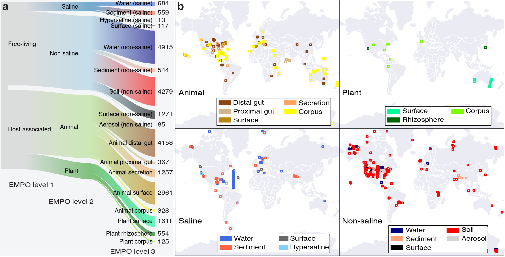

## figures

Code to generate the figures in "A communal catalogue reveals Earth’s multiscale microbial diversity", *Nature* (2017), by Thompson et al. This manuscript describes the meta-analysis of EMP 16S Release 1, the first 97 studies subjected to 16S rRNA amplicon sequencing through the [Earth Microbiome Project](http://www.earthmicrobiome.org).

Notes:

* The most heavily used data files are stored in `data`. All data files listed in `data/ftp_contents.txt` are available from ftp://ftp.microbio.me/emp/release1.
* The mapping file (metadata) for analyses unless otherwise noted is `data/mapping_files/emp_qiime_mapping_qc_filtered.tsv`.

#### Primary processing: generation of sequence observation tables from demultiplexed sequence data

This section describes the commands to download the raw sequence data from EBI and perform OTU picking using different methods, including generating phylogenetic trees and taxonomies for reference sequences, if necessary.

**Step 1. Download sequences.** Sequences can be downloaded directly from EBI using the script `download_ebi_fasta.sh` or `download_ebi_fastq.sh` in `code/download-sequences`, depending on whether fasta or fastq sequences are desired. Fasta sequences are used by the steps below. The sequences from EBI are demultiplexed and minimally quality filtered according to the default parameters of the QIIME 1 command [split_libraries_fastq.py](http://qiime.org/scripts/split_libraries_fastq.html).

```
bash download_ebi_fasta.sh
```

**Step 2. OTU picking and Deblur.** Four separate OTU picking procedures were run on the EMP Release 1 data: closed-reference using Greengenes 13.8, closed-reference using Silva 123, open-reference using Greengenes 13.8, and de novo using Deblur.

*Closed-reference Greengenes 13.8.* Closed-reference OTU picking against Greengenes 13.8 was done using the QIIME 1 script [pick_closed_reference_otus.py](http://qiime.org/scripts/pick_closed_reference_otus.html).

*Closed-reference Silva 123.* Closed-reference OTU picking against Silva 123 16S was done using the QIIME 1 script [pick_closed_reference_otus.py](http://qiime.org/scripts/pick_closed_reference_otus.html).

*Open-reference Greengenes 13.8.* Closed-reference OTU picking against Greengenes 13.8 was done using the QIIME 1 script [pick_open_reference_otus.py](http://qiime.org/scripts/pick_open_reference_otus.html).

*Deblur.* Deblur sOTU (tag sequence) picking was done using a pre-release version of Deblur. That workflow can be called from the script `run_deblur_emp_original.sh` in `code/03-otu-picking/deblur`. The analogous workflow using the current distribution of Deblur can be called from the script `run_deblur_emp_new.sh`.

**Step 3. Phylogenetic trees**

*Open-reference tree.* Reference sequences from the open-reference OTU picking were aligned using [PyNAST](https://biocore.github.io/pynast/) and the tree built using [FastTree](https://www.msi.umn.edu/sw/fasttree).

*Deblur tree.* Deblur sequences were inserted into the Greengenes reference tree using [SEPP](https://github.com/smirarab/sepp). The code for this method is in `code/phylogenetic-placement/run_sepp.sh`.

#### Figure 1. Environment type and provenance of EMP samples included in this meta-analysis. 



**Figure 1a.** Generated from mapping file column `empo_3` using Google Charts [Sankey Diagram](https://developers.google.com/chart/interactive/docs/gallery/sankey).

**Figure 1b.** Generated from mapping file columns `latitude_deg` and `longitude_deg` using IPython Notebook [map_samples_by_empo.ipynb](https://github.com/biocore/emp/blob/master/ipynb/01-metadata-processing/map_samples_by_empo.ipynb).

#### Figure 2. Alpha-diversity, beta-diversity, and predicted average 16S rRNA gene copy number. 


**Figure 2a.** 

**Figure 2b.** 

**Figure 2c.** 

**Figure 2d.** 

#### Figure 3.


**Figure 3a.** 

**Figure 3b.** 

**Figure 3c.** 

#### Figure 4.


**Figure 4a.** 

**Figure 4b.** 

**Figure 4c.** 
