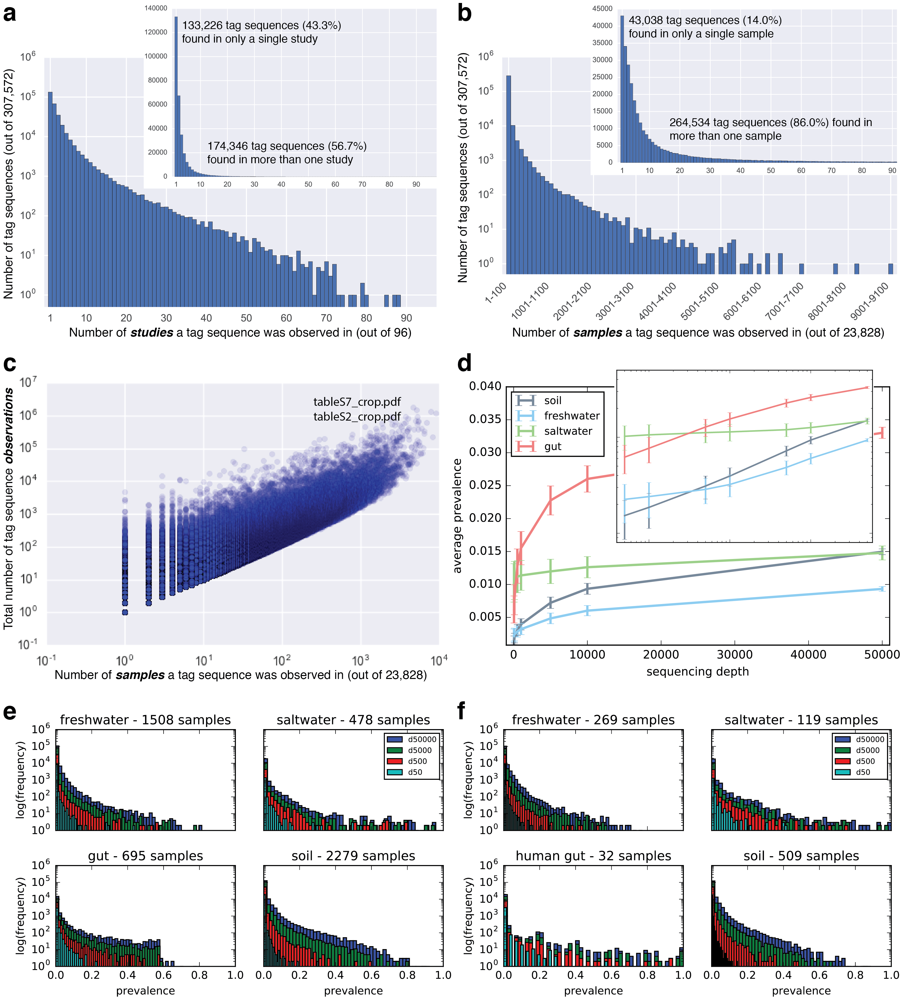
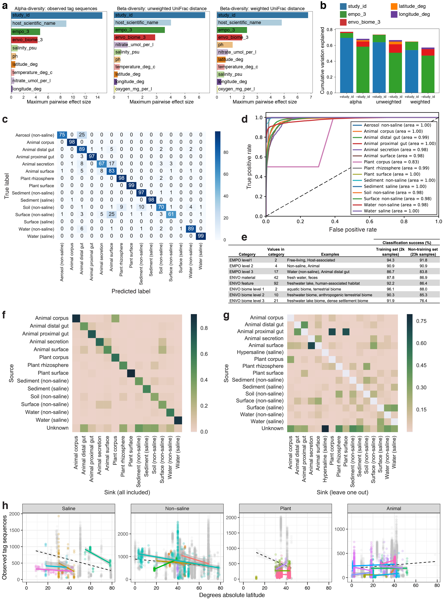
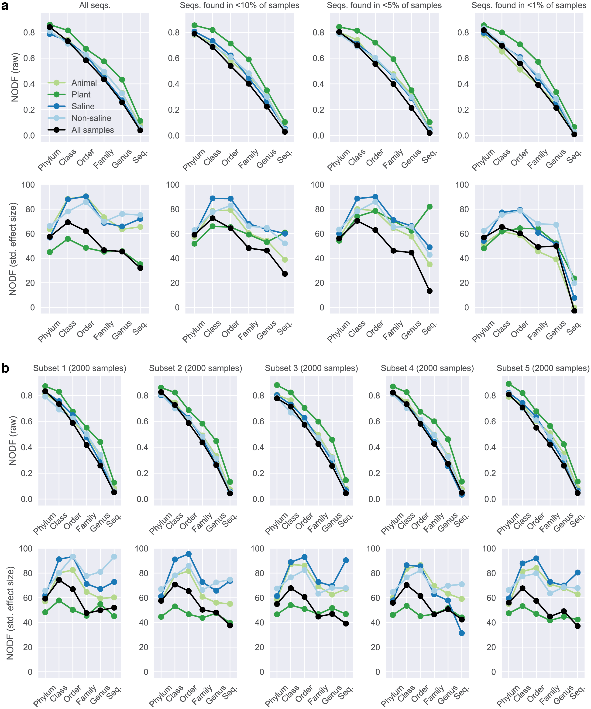
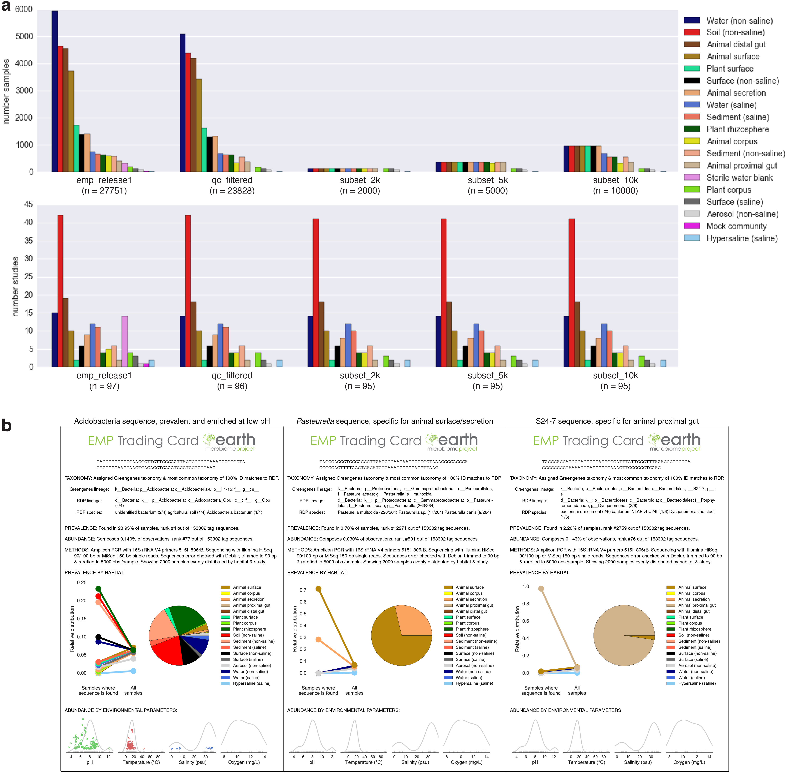

## figures

Instructions to generate the figures in "A communal catalogue reveals Earth’s multiscale microbial diversity", Thompson et al., *Nature* (2017). This manuscript describes the meta-analysis of EMP 16S Release 1, the first 97 studies subjected to 16S rRNA amplicon sequencing through the [Earth Microbiome Project](http://www.earthmicrobiome.org).

Code and notebooks for generating these figures are in the top-level directory `code`, as described below.

Input data files for generating the figures below are found in several places:

* All data files (except sequences) required to generate the figures below are available from ftp://ftp.microbio.me/emp/release1; full contents are listed in `data/ftp_contents.txt`. 
* All data files (except sequences) for this manuscript are archived with Zenodo, available from DOI [XXX](http://doi.org/XXX).
* Sequences files are available directly from EBI (see below).
* The mapping file (metadata) for analyses unless otherwise noted is `emp_qiime_mapping_qc_filtered.tsv` in `data/mapping_files`.
* Select smaller data files (<100 GB) are also stored in `data`.

### 1 Amplicon sequence processing

This section describes the commands to download the raw sequence data from EBI and perform OTU picking using different methods, including generating phylogenetic trees and taxonomies for reference sequences, if necessary.

#### 1.1 Download demultiplexed fasta sequence files

Per-study sequence files can be downloaded directly from EBI using scripts in `code/download-sequences`:

* `download_ebi_fasta.sh` (FASTA) 
* `download_ebi_fastq.sh` (FASTQ) 

Fasta sequences are used by the steps below. The sequences from EBI were demultiplexed and minimally quality filtered using the QIIME 1 command [split_libraries_fastq.py](http://qiime.org/scripts/split_libraries_fastq.html) with Phred quality threshold of 3 and default parameters.

#### 1.2 Generation of OTU/sequence observation tables

Four separate OTU picking procedures were run on the EMP Release 1 data: de novo using Deblur, closed-reference using Greengenes 13.8, closed-reference using Silva 123, and open-reference using Greengenes 13.8.

##### 1.2.1 Deblur (de novo sequence variant determination)

Deblur code for picking sOTUs (a.k.a. tag sequences or amplicon sequence variants) is in `code/03-otu-picking-trees/deblur`:

* `run_deblur_emp_original.sh` (pre-release version used for this meta-analysis)
* `run_deblur_emp_new.sh` (using published Deblur version)

Code and documentation for Deblur can be found on [GitHub](https://github.com/biocore/deblur), and the manuscript describing Deblur is available from [mSystems](http://msystems.asm.org/content/2/2/e00191-16).

##### 1.2.2 Closed-reference against Greengenes 13.8

Closed-reference OTU picking against Greengenes 13.8 (97% OTUs) was done using the QIIME 1 script [pick_closed_reference_otus.py](http://qiime.org/scripts/pick_closed_reference_otus.html) with code in `code/03-otu-picking-trees/closed-ref`:

* `closed_reference_otu_picking.ipynb`

##### 1.2.3 Closed-reference against Silva 123

Closed-reference OTU picking against Silva 123 16S (97% OTUs) was done using the QIIME 1 script [pick_closed_reference_otus.py](http://qiime.org/scripts/pick_closed_reference_otus.html) with code in `code/03-otu-picking-trees/closed-ref`:

* `closed_reference_otu_picking.ipynb`

##### 1.2.4 Open-reference against Greengenes 13.8

Open-reference OTU picking against Greengenes 13.8 was done using the QIIME 1 script [pick_open_reference_otus.py](http://qiime.org/scripts/pick_open_reference_otus.html) with code in `code/03-otu-picking-trees/open-ref`:

* `open_reference_otu_picking.ipynb`

#### 1.3 Phylogenetic trees

##### 1.3.1 Deblur

Deblur sequences were inserted into the Greengenes reference tree using [SEPP](https://github.com/smirarab/sepp). The code for this method is in `code/03-otu-picking-trees/deblur`:

* `run_sepp.sh`

##### 1.3.2 Closed-reference Greengenes 13.8

The reference tree for Greengenes 13.8 (97% OTUs) was `97_otus.tree`, available from the [EMP FTP site](ftp://ftp.microbio.me/emp/release1/otu_info/greengenes_13_8/) and the [Greengenes FTP site](ftp://greengenes.microbio.me/greengenes_release/gg_13_5/gg_13_8_otus.tar.gz).

##### 1.3.3 Closed-reference Silva 123

The reference tree for Silva 123 16S (97% OTUs) was `97_otus.tre`, available from the [EMP FTP site](ftp://ftp.microbio.me/emp/release1/otu_info/silva_123/) and the [Silva website](https://www.arb-silva.de/documentation/release-123/).

##### 1.3.4 Open-reference Greengenes 13.8

Reference sequences from the open-reference OTU picking were aligned using [PyNAST](https://biocore.github.io/pynast/) and the tree built using [FastTree](https://www.msi.umn.edu/sw/fasttree).

#### 1.4 Rarefaction of tables

Deblur and OTU tables were rarefied (subsampled) to generate equal numbers of observations (sequences) per sample, used in many of the analyses as described below. Deblur tables were rarefied to 5000 observations per sample, and reference-based OTU tables were rarefied to 10000 observations per sample, each using the QIIME 1 script [single_rarefaction.py](http://qiime.org/scripts/single_rarefaction.html). 

#### 1.5 Subsets of tables

Deblur/OTU tables were subset to generate tables with more even representation across sample types and studies, used in many of the analyses as described below. Subsetting of the tables is accomplished by running the following IPython notebooks in `code/04-subsets-prevalence`:

* `observation_table.ipynb`
* `subset_samples_by_empo_and_study.ipynb`

### 2 Metadata processing

QIIME mapping files were downloaded from [Qiita](https://qiita.microbio.me) and refined to fix errors, standardize formatting, and add fields specific for this investigation. 

Three IPython notebooks are provided to curate study metadata (step 1), refine sample metadata (step 2), and generate new sample information files for those studies to upload to Qiita (step 3). These notebooks are located in `code/01-metadata`:

* `metadata_refine_step1_studies.ipynb`
* `metadata_refine_step2_samples.ipynb`
* `metadata_refine_step3_qiita.ipynb`

A notebook for looking up higher (less semantically granular) terms for a given ENVO biome term, which is incorporated in step 2 above, is in `code/01-metadata`:

* `envo_hierarchy_lookup.ipynb`

A metadata template generator, for future metadata collection, is provided as a Python script and a Markdown version of an IPython notebook in `code/01-metadata`:

* `metadata_template_generator.md`
* `metadata_template_generator.py`

### 3 Generating figures

#### 3.1 Environment type and provenance of EMP samples included in this meta-analysis (Fig. 1)

##### 3.1.1. Sankey diagram (Fig. 1a)

Sankey generated from mapping file column `empo_3` using Google Charts [Sankey Diagram](https://developers.google.com/chart/interactive/docs/gallery/sankey). Here is the current version of the Sankey diagram: https://jsfiddle.net/aqxw0cqz/8/. Note that you can turn on the text labels by changing line 61.

##### 3.1.2 World map (Fig. 1b)

Map generated from mapping file columns `latitude_deg` and `longitude_deg` using IPython notebook `map_samples_by_empo.ipynb` in `code/01-metadata`.

#### 3.2 Alpha-diversity, beta-diversity, and predicted average 16S rRNA gene copy number (Fig. 2)

##### 3.2.1 Alpha-diversity boxplots (Fig. 2a)

Alpha-diversity for the Deblur 90-bp table (QC-filtered) subset was run using the script `alpha_diversity.py` in `code/05-alpha-diversity`. The results for the Deblur 90-bp table rarefied to 5000 sequences per sample were added to the mapping file as the columns adiv_observed_otus, adiv_chao1, adiv_shannon, and adiv_faith_pd.

##### 3.2.2 Alpha-diversity vs. pH and temperature (Fig. 2b)

<!--
Ken's repo: https://github.com/klocey/emp_macroeco
-->

##### 3.2.3 Beta-diversity principal coordinates (Fig. 2c)

##### 3.2.4 Predicted average 16S rRNA copy number (Fig. 2d)

#### 3.3 Nestedness of community composition (Fig. 3)

##### 3.3.1 Nestedness binary heatmap of all samples (Fig. 3a)

##### 3.3.2 Nestedness binary heatmap of EMPO level 2 classes (Fig. 3b)

##### 3.3.3 NODF scores vs. taxonomic level (Fig. 3c)

<!--
A GitHub repository that can be used to easily replicate the results is located here:

https://github.com/jladau/Nestedness.EMP

As noted in the repository, the data files that were used are posted at this Dropbox link:

https://www.dropbox.com/s/velnv86z1l81ilx/nestedness_emp_data.tar.gz?dl=0

Is there an EMP GitHub repository where the data can be posted, or alternatively, can you point to where these files are already posted? For consistency with the file naming conventions that I used, some of the files in Dropbox are renamed as follows (they have also each been rarefied to 5000 reads):

otu_subset.emp_deblur_90bp.subset_2k.lt_1.0_pc_samp.biom -> Global.Global2000Subset.BacteriaSubset1.EMP.biom
otu_subset.emp_deblur_90bp.subset_2k.lt_5.0_pc_samp.biom -> Global.Global2000Subset.BacteriaSubset5.EMP.biom
otu_subset.emp_deblur_90bp.subset_2k.lt_10.0_pc_samp.biom -> Global.Global2000Subset.BacteriaSubset10.EMP.biom
emp_deblur_90bp.subset_2k.rare_5000.biom -> Global.Global2000Subset.Bacteria.EMP.biom
-->

#### 3.4 Specificity of tag sequences for environment (Fig. 4)

##### 3.4.1 EMPO level 3 distribution of genera and tag sequences (Fig. 4a)

##### 3.4.2 Entropy of EMPO level 3 distribution vs. taxonomic level (Fig. 4b)

##### 3.4.3 Entropy of EMPO level 3 distribution vs. branch length (Fig. 4c)

#### 3.5 Physicochemical properties of the EMP samples (Extended Data Fig. 1)

The pairplot of physicochemical metadata was generated using IPython notebook `physicochemical_pairplot.ipynb` in `code/01-metadata`.

#### 3.6 Sequence length, database effects, and beta-diversity patterns (Extended Data Fig. 2)

The histogram of median sequence length after trimming (output of split_libraries.py, i.e., sequences downloaded from EBI) was generated using IPython notebook `sequence_length.ipynb` in `code/02-sequence-processing`.

#### 3.7 Sequence length effects on observed diversity patterns (Extended Data Fig. 3)

#### 3.8 Tag sequence prevalence patterns (Extended Data Fig. 4)

#### 3.9 Environmental effect sizes, sample classification, and correlation patterns (Extended Data Fig. 5)

#### 3.10 NODF scores of nestedness across samples by taxonomic level (Extended Data Fig. 6)

#### 3.11 Subsets and EMP Trading Cards (Extended Data Fig. 7)

<!--
REDBIOM
    # assuming an interactive job
    
    cp /home/mcdonadt/emp-create-redbiomdb/emp-redbiom.rdb /localscratch/
    
    /home/mcdonadt/redis-3.2.6/src/redis-server --daemonize yes --dbfilename /localscratch/emp-redbiom.rdb
    /home/mcdonadt/webdis/webdis &
    
    source activate redbiom
    
    export REDBIOM_HOST=http://127.0.0.1:7379
    
    # IMPORTANT, redis will not service requests until the database is loaded, and it takes a few minutes. redbiom queries during that time will error with a confusing error (hadn't encountered this before...)
    
    # memory foot print is like 18.5GB
    
    # recommending using redis / webdis out of my home right now to avoid compilation, but i think just pointing to redbiom readme would be fine?
-->

